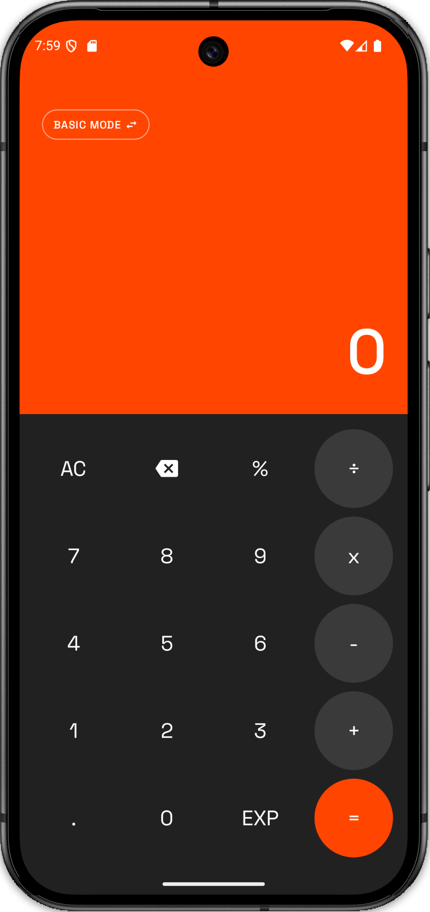
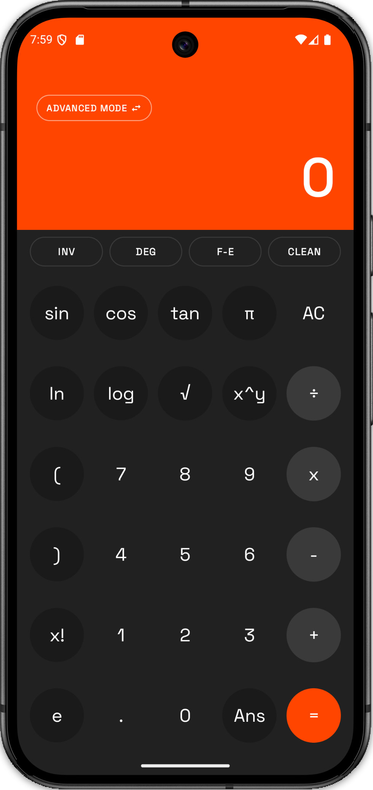
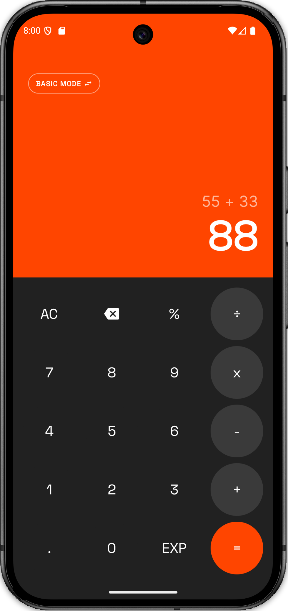

# Calculator App (Android)

<p align="center">
  
  
  
</p>

A modern, highly modularized Android Calculator application built with **Jetpack Compose**, **Hilt**, and **Navigation 3**, following a "Clean Architecture" inspired structure.

---

## 🚀 Key Features

-   **Jetpack Compose:** Fully declarative UI using modern Android development practices.
-   **Navigation 3:** Implementation of the latest Navigation 3 (Stable 1.0.1) for handling screen transitions.
-   **Modular Architecture:** Clean separation of concerns with a multi-module approach.
-   **Dependency Injection:** Using **Hilt** to manage dependencies across all modules.
-   **Modern Tech Stack:** Kotlin 2.3.20 (K2 compiler) and AGP 9.1.0 for a future-proof development experience.

---

## 🛠 Tech Stack & Why We Used It

### 🧪 Kotlin & Android Gradle Plugin (AGP)
-   **Kotlin 2.3.20 (K2):** We use the latest Kotlin version with the K2 compiler enabled by default for faster compilation and better language features.
-   **AGP 9.1.0:** Since AGP 9.0+, Kotlin support is handled internally. We don't manually apply the `org.jetbrains.kotlin.android` plugin in every module; AGP detects Kotlin automatically.

### 🎨 UI & Design
-   **Jetpack Compose:** The modern toolkit for building native Android UI. It simplifies UI development by using a declarative approach.
-   **Thermal Industrial Theme:** A custom design system (located in `core:designsystem`) that provides a consistent look and feel using atomic design principles.

### 🧭 Navigation
-   **Navigation 3 (1.0.1):** We use the new Navigation 3 library which offers a more type-safe and Kotlin-friendly way to handle navigation. It replaces the older `NavHost` with `NavDisplay` and uses `@Serializable` routes.

### 💉 Dependency Injection
-   **Hilt:** Built on top of Dagger, Hilt simplifies DI in Android apps by providing a standard way to incorporate Dagger into your project.

### 🏗 Architecture
-   **Modular "Clean Architecture":** We've split the app into multiple modules (`app`, `core`, `feature`, `navigation`) to improve build times, maintainability, and testability.
-   **Build Logic (Convention Plugins):** We use the `build-logic` folder to share common build configurations across modules, keeping our `build.gradle.kts` files clean and concise.

---

## 📁 Folder Structure Explained

### 🏰 Root Level
-   **`app/`**: The main entry point of the app. It handles high-level orchestration, Hilt setup, and navigation hosting.
-   **`build-logic/`**: Contains **Convention Plugins**. Instead of repeating the same build logic in every module, we define it once here and apply it where needed.
-   **`navigation/`**: Centralizes all navigation routes (`Screen` interface). This module is shared across features to allow them to navigate to each other without knowing about each other's implementations.

### 🧱 Core Modules (`core/`)
-   **`common/`**: Pure Kotlin logic with **zero** Android dependencies. Contains the `ExpressionParser` and utility classes like `ResultWrapper`.
-   **`designsystem/`**: The "Atomic" design system. Contains colors, typography, and the overall app theme.
-   **`ui/`**: Reusable UI components (like `CalcButton`) that can be shared across different feature modules.

### ✨ Feature Modules (`feature/`)
-   **`calculator/`**: The main feature of this app. It contains the ViewModel, UseCases, and Compose screens for the calculator functionality.

---

## 💡 How Things Work in This Project

### 1. The Build System (Convention Plugins)
A common problem in multi-module projects is that you end up with a lot of duplicate code in your `build.gradle.kts` files. To solve this, we use the `build-logic` module. 
- It defines "Conventions" (like `convention.android-library` or `convention.feature-module`).
- These are precompiled scripts that automatically apply the right plugins and dependencies.
- **For Beginners:** Think of it as a "template" for your build settings.

### 2. Navigation 3 Implementation
Navigation 3 is different from previous versions. Here's how we set it up:
- **Routes:** Defined in the `navigation` module using `@Serializable` objects.
- **BackStack:** Managed by `rememberNavBackStack`.
- **NavDisplay:** The new component that observes the backstack and displays the correct screen.

```kotlin
// Example in AppNavHost.kt
val backStack = rememberNavBackStack(Screen.Calculator)

NavDisplay(
    backStack = backStack,
    onBack = { backStack.removeLastOrNull() },
    entryProvider = entryProvider {
        entry<Screen.Calculator> {
            CalculatorRoute()
        }
    }
)
```

### 3. Dependency Injection with Hilt
Hilt helps us pass objects (like `EvaluateExpressionUseCase`) into our ViewModels without manually creating them every time. 
- We use `@HiltViewModel` on our ViewModels.
- We use `@Inject` to tell Hilt which objects we need.
- Modules are annotated with `@Module` and `@InstallIn` to define how these objects are created.

---

## 🏁 Getting Started

1.  **Clone the repo:** `git clone <repository-url>`
2.  **Open in Android Studio:** Use the latest version (Ladybug or newer recommended).
3.  **Sync Gradle:** Let Android Studio download dependencies.
4.  **Run:** Click the "Run" button to launch the app on your device or emulator.

---

## 📝 For Android Beginners

If you're new to Android development, here's a quick guide to some concepts used here:
-   **Jetpack Compose:** The UI is built using "Composable" functions. They describe what the UI should look like based on the current state.
-   **ViewModel:** This is where the "logic" lives. It survives screen rotations and holds the UI state.
-   **State:** The UI "observes" a state object. When the state changes (e.g., you press a button), the UI automatically updates.
-   **UseCase:** These represent a single action the user can perform (like "Evaluate Expression"). They help keep the ViewModel clean.

---

*This project is built with 💙 for the Android Community.*
